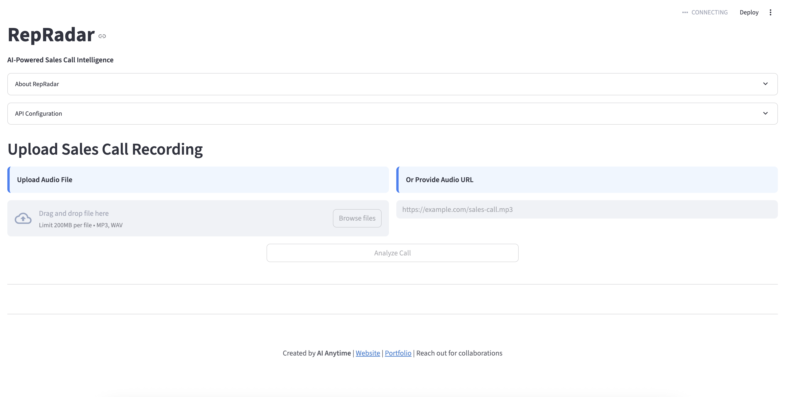

# Voxtral Streamlit App
 
## RepRadar: AI-Powered Sales Call Intelligence

[](https://www.streamlit.io/)
[](https://mistral.ai/)
[](https://opensource.org/licenses/Apache-2.0)

## 🔍 Overview

RepRadar is an AI-powered sales call analysis tool that helps sales teams improve their performance by automatically analyzing sales call recordings. Leveraging Mistral's cutting-edge Voxtral model for audio processing, RepRadar transcribes sales calls, segments them into different stages, identifies objections and competitor mentions, scores rep performance, and provides actionable coaching recommendations.



## ✨ Key Features

- **Audio Transcription**: Upload or provide URL to sales call recordings and get precise transcriptions with timestamps
- **Call Segmentation**: Automatically segment calls into introduction, discovery, demo, objections, and closing phases
- **Objection Detection**: Identify and categorize customer objections
- **Competitive Intelligence**: Extract mentions of competitors and related insights
- **Rep Performance Scoring**: Score sales rep performance across multiple dimensions
- **Talk-Time Analysis**: Visual breakdown of who dominated the conversation
- **AI-Powered Coaching**: Get actionable tips to improve sales techniques
- **Interactive Dashboard**: Clean, modern UI with multiple visualization tabs
- **BYOK (Bring Your Own Key)**: Use your own Mistral API key

## 🧠 How It Works

RepRadar uses Mistral's Voxtral model, which represents a significant advancement in audio processing and understanding. The app follows this workflow:

1. **Audio Input**: Upload MP3/WAV audio files or provide audio URLs
2. **Transcription**: The Voxtral API transcribes audio with timestamps
3. **Segmentation**: Segments are analyzed and grouped into call stages
4. **Analysis**: Mistral's API extracts insights, objections, and coaching recommendations
5. **Visualization**: Results are displayed in an intuitive dashboard

## 🛠️ Technology Stack

- **Frontend & App Framework**: Streamlit
- **AI Processing**: Mistral AI's Voxtral model
- **Data Visualization**: Plotly, Pandas
- **API Integration**: Requests, Python-dotenv
- **Audio Processing**: Pydub

## 📋 Prerequisites

- Python 3.12+
- Mistral API key (get one from [Mistral AI Console](https://console.mistral.ai/))

## 🚀 Installation & Setup

1. Clone the repository:
   ```bash
   git clone https://github.com/AIAnytime/Voxtral-Streamlit-App
   cd Voxtral-Streamlit-App
   ```

2. Install dependencies:
   ```bash
   pip3 install -r requirements.txt
   ```

3. Create a `.env` file in the project root with your Mistral API key (optional):
   ```
   MISTRAL_API_KEY=your_api_key_here
   ```
   Note: You can also provide your API key directly through the app interface.

4. Run the app:
   ```bash
   streamlit run main.py
   ```

## 💻 Usage

1. Open the app in your browser (typically at http://localhost:8501)
2. Enter your Mistral API key in the API Configuration section (or use the one in your .env file)
3. Upload an audio file or provide a URL to an audio file of a sales call
4. Click "Analyze Call" to process the audio
5. Explore the results across five tabs:
   - **Transcript**: View the full call transcript with timestamps
   - **Overview**: See call metrics and timeline visualization
   - **Objections**: Review detected customer objections and competitor mentions
   - **Rep Performance**: Analyze rep performance scores and talk time distribution
   - **Coaching**: Get AI-generated coaching tips and example responses

## 🎛️ API Configuration

RepRadar requires a Mistral API key to function. You have two options:

1. **Environment Variable**: Add your key to a `.env` file
2. **In-App Entry**: Provide your key directly in the app's API Configuration section

The app will prioritize the key entered through the UI over the environment variable.

## 📊 Understanding the Dashboard

### Transcript Tab
- Complete transcription with timestamps
- Call segmentation by stages (intro, discovery, etc.)

### Overview Tab
- Key metrics: call duration, word count, talk ratio, filler words
- Call timeline visualization showing speaker and call stage
- Key topics and highlights from the conversation

### Objections Tab
- List of customer objections extracted from the call
- Competitor mentions and related insights

### Rep Performance Tab
- Radar chart showing performance scores across dimensions
- Talk time distribution between rep and customer

### Coaching Tab
- AI-generated coaching tips specific to the analyzed call
- Example responses to common objections

## 🔍 Project Structure

```
repradar/
├── main.py            # Main application code
├── requirements.txt   # Project dependencies
├── .env              # Environment variables (API keys)
└── README.md         # Project documentation
```

## 🔮 Future Enhancements

- Speaker diarization for multi-person calls
- More sophisticated NLP-based call segmentation
- CRM integration for storing call analyses
- Batch processing for multiple calls
- Trend analysis across multiple calls
- Custom scoring metrics and templates

## 👨‍💻 Creator

Created by **AI Anytime**

- Website: [aianytime.net](https://aianytime.net)
- Portfolio: [sonukumar.site](https://sonukumar.site)
- For collaborations, please reach out through the website

## 📜 License

This project is licensed under the Apache 2.0 License.
